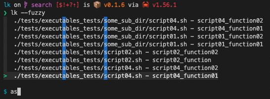
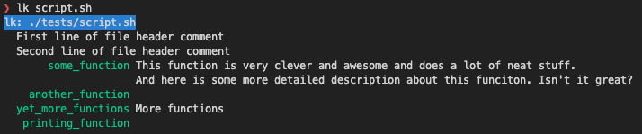
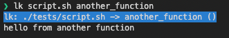

# lk

A CLI frontend for your bash scripts. 

Parses scripts and pretty prints the functions it finds. Similar to [run_lib](https://github.com/jamescoleuk/run_lib) but rustier, and to [runsh](https://github.com/jamescoleuk/runsh) but better.

If you ran it on this repo you'd see something like this:



So it's found all executable bash scripts in this and all sub-directories. You could then do this:



That's all all the functions in `script.sh` along with comments. You can execute a function like this:



That's it.

## Features 
 - `lk` finds executable non-binary files in the current directory and any sub-directory
 - `lk` finds and displays comment headers from your scripts 
 - `lk` finds and displays comments for functions
 - `lk` ignores functions prefixed with `_`. 
 - `lk` uses a temporary file to execute the script, but you shouldn't need to worry about that

## Installation
From [the crate](https://crates.io/crates/lk):
```bash
cargo install lk
```

### Update
```bash
cargo install --force lk
```

## Use
Just execute `lk` and follow the instructions.

### An example bash script

I don't want you to have to alter your scripts to use `lk`. I want it to just find your stuff, magically. If you have a problem I implore you to let me know so I can fix it. Thanks in advance!

Having said that, a script might look something like this:

```
#!/usr/bin/env bash

# This function is very clever and awesome and does a lot of neat stuff.
# And here is some more detailed description about this funciton. Isn't it great?
some_function() {
    echo "hello world from a script"
    echo "foobar"
    sleep 1
    echo "ending function now"
}

# More functions
yet_more_functions() {
    echo "hello from another function"
}
```


## Why the name "lk"?
If you have any typist home key dicipline and if you flap your right hand at the keyboard there's a good chance you'll type 'lk'. So it's short, and ergonomic.


### File headers
`lk` will extract comments in the file header, if it finds any, and display them alongside all your runnable functions. It relies on these comments following the form in the [Google Shell Style Guide](https://google.github.io/styleguide/shellguide.html#s4.1-file-header), i.e. like this:
```bash
#!/usr/bin/env bash
#
# Some comments.
# And some more.
```

## Why not run_lib?

I already wrote this in bash and called it [run_lib](https://github.com/jamescoleuk/run_lib). There are a few reasons why this might be better. Here are some considerations:
1. A Rust executable is easier to distribute via `cargo`. It's easier for people to update their version. 
2. Integration with a script is more or less the same. 
3. The processing is much easier in Rust than it is in bash, i.e. finding and displaying multi-line comments. 
4. 


The truth is I wrote this in Rust because I'm a magpie but now I'm in love with Rust in a very embarassing way.