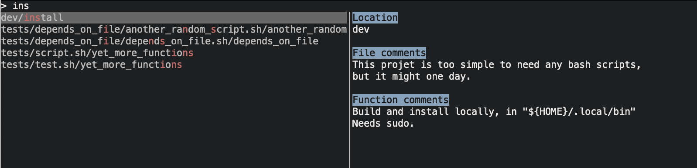
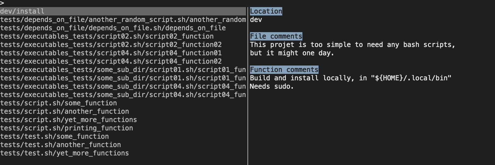

# lk

[](https://crates.io/crates/lk)

## Overview

A command palette for your bash functions. Run in a dir with lots of bash files, fuzzy find a function, and run it. It looks like this:



## Modes

You can explore your bash functions in three different ways:

1. The Terminal User Interface (TUI), which takes up the whole terminal window

2. An `fzf` style inline search

3. By printing out lists of functions.

### TUI

The default mode (`--tui` or `-t`).

Here's `lk` run on it's own repo.

 

It has fuzzy find::


You hit enter to run the functioun.

### Inline fuzzy find

The old default (`--fuzzy` or `-f`):


This also has fuzzy find, obviously:


### Lists

You can also explore bash files via the *List* mode (`--list`), like this:


You can drill into those files to see what functions they have. Notice that you don't need `--list` now:


You can execute the functions them by passing the function name:


This means you can write scripts that use `lk`, if you want to. 

### Changing the default mode

You can change the default mode by editing `lk`'s config file, which lives at `~/.config/lk/lk.toml`:


The log file lives in that directory, if you're interested or maybe want to contribute to `lk`'s development. You can see all of `lk`'s options by running `lk --help`, obviously.

## Why use `lk`?

1. You're a polyglot engineer with package manager fatigue. So you want to hide it all behind some bash, the lingua franca.
2. You do a lot of devops and have a lot of bash.
3. You have a lot of projects that you don't work on for months at a time, and you need to bring some consistency to the experience of re-visiting them.
4. You use `make` and `PHONY` to do non-compile stuff to your project. `lk` just lets your write proper bash without all the `make` specific guff.
5. You ever copy and paste bash from a text file you keep somewhere.

## Installing

### Homebrew

```shell
brew tap jamescoleuk/taps
brew install lk
```

### Cargo

```shell
cargo install lk
```

## How to write bash files so they work with `lk`

`lk` executes bash functions. This sort of thing:

```bash
# A glorious function that does all the things
be_glorious() {
    echo "Ta da!"
} 
```

It executes these functions by sourcing the file, and then running the function. The equivelant of this:

```bash
. my_file.sh
be_glorious
```

This means anything outside a function will be executed. This is handy if you want to source other files, or set environment variables, because they'll be available to your functions. For example:

```bash
#!/usr/bin/env bash
#
# Some comments.

. "~/scripts/lib.sh"
readonly DATABASE_USER="johnsmith"

# A glorious function that does all the things
be_glorious() {
    echo "Database user is ${DATABASE_USER}"
} 
```

But this does mean most of the functional stuff in your script needs to be in functions. I appreciate this may not be how everyone wants to work, but it's fine for many use cases. The last thing I want to do is tell people how to write their scripts.

Incidentally, the comments in the scripts above will appear in `--list` mode, like this:


So `--list` mode allows you explore and discover your scripts, and `--fuzzy` mode lets you get to functions you are perhaps already more familiar with.

If you use `--fuzzy` then `lk` will write the command you executed to your bash history, so you can use `ctrl-r` to re-execute it. Obviously if you used `--list` it will already be there.

## Ignoring files

`lk` supports glob-based excludes and includes, using [toml](https://toml.io/en/). For example:

```toml
excludes = [
  "**/exclude_me",
  "target",
  ".git",
]
```

You can make this global by putting it in `~/.config/lk/lk.toml`, or local by creating a `lk.toml` file in, say, a project directory. If the `lk.toml` file is in the same directory from which you execute `lk` then it'll find and use it. You can also add includes and excludes as a switch. See `lk --help` for details.

## Ignoring functions

 If you prepend a function with an underscore it will be ignored by `lk`:

```bash
_my_ignored_function() {
   echo "not happening"
}
```

## Installation

From [the crate](https://crates.io/crates/lk):

```bash
cargo install lk
```

## Update

```bash
cargo install --force lk
```

# 

## Use case examples

1. AWS: 
   1. You need to pull down config from AWS and store it in `.env` files.
   2. You need to switch between AWs environments
2. You need to build and deploy many services, and want to hide the edge cases. E.g. for compiling, building, and deploying you might have `lk my_service jfdi`.
3. You regularly need to set up SSH tunneling and can't remember the commands.

## Why the name "lk"?

If you have any typist home key dicipline and if you flap your right hand at the keyboard there's a good chance you'll type 'lk'. So it's short, and ergonomic.

## What could be improved?

* Minor UI improvements?
* Support scripts in other languages, e.g. Python, rust-script, Typescript.
* Disable colours, for the colourblind
* Add a count to `lk --fuzzy`
* Sensible default ignores
* Make it installable via other routes, e.g. `brew`.

Contributions make my heart grow warm. I'm happy to support anyone who wants to contribute. Also, if you're new to Rust then I'd be happy to deepen that support to whatever extent you need. 

## Inspiration

I have previously written two similar tools: 

* [run_lib](https://github.com/jamescoleuk/run_lib) - my first draft and written in bash
* [runsh](https://github.com/jamescoleuk/runsh) - my second draft and written in Rust

`run_lib` still has its uses. I've worked in secure environments where I could not have installed a binary. `run_lib` is just a bash script.

[fzf](https://github.com/junegunn/fzf) is wonderful. The `--fuzzy` option in `lk` comes from years of `ctrl-r` fuzzy finding through my shell history with `fzf`. I almost didn't implement this feature because I thought "why bother? fzf has already done it perfectly." Or rather I thought about piping from `lk` to `fzf`. But having the functionality implemented natively is the right thing for `lk`. But you'll notice, perhaps, that the rendering of the fuzzy search in `lk` draws a lot of visual inspiration from `fzf`. `fzf`, I love you.

## Contributing

Contributions are welcome. Thanks to the following for theirs:

* [lagoa89](https://github.com/lagoa89)
* [traxys](https://github.com/traxys)
* [lmburns](https://github.com/lmburns)
